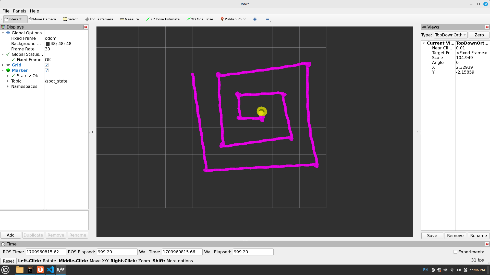

# Spot State Decoder Node in ROS2 

## How to run bag file 

create a ``realiability_override.yaml`` file with following configuration 

```yaml
/odometry/filtered:
  reliability: best_effort
  history: keep_last
  depth: 1
```
Then create a ``rosbagPlayer.sh`` file with follwing command or use a terminal with following command  
```bash 
ros2 bag play --qos-profile-overrides-path reliability_override.yaml rosbag2_2024_03_07-17_12_09
```

## Trajectory viewer 

To see trajectory use the following command 
```bash 
ros2 run spot_state_decoder spot_state_decoder_node 
```
Configure RVIZ with follwoing settings 

